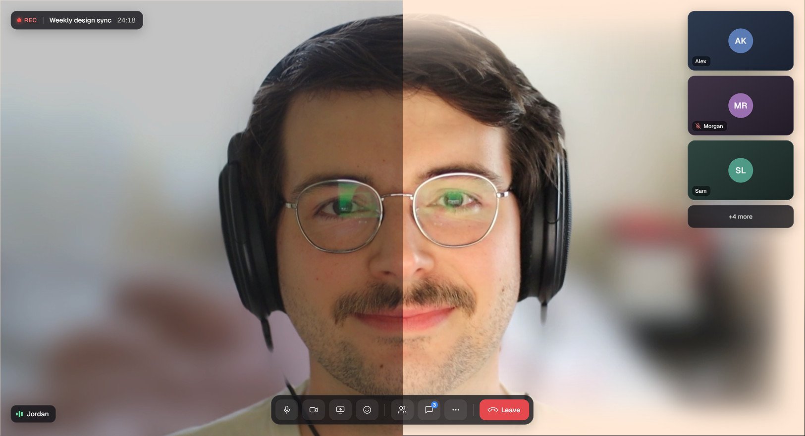
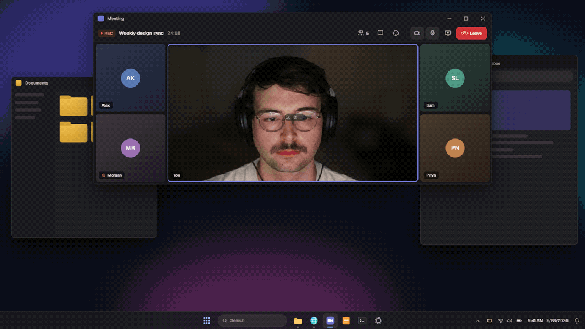

# Screenlight

**Look sharper on camera.** Screenlight turns your screen's edges into a soft ring light. It evens out your face and brightens your eyes on every video call, with no extra hardware.

**Windows · macOS · Linux**. It's free and open source, a single ~3.5 MB native app.



<sub>Left: a normal video call. Right: the same call with Screenlight on.</sub>

## How it works

Press the hotkey (or let your camera turn it on), and a soft light wraps the edges of every screen. A small HUD lets you dial in the warmth, width and softness, then gets out of your way.



## What it does

- **Ctrl + Alt + L** (Ctrl + Option + L on macOS) toggles the light and briefly shows the HUD.
- **Tray icon**: left-click toggles the light. Right-click opens the menu (Light / Adjust… / Quit).
- **HUD**: Intensity (0–100% opacity), Warmth (2000–9000 K), Width, Softness. It fades out on its own when you're not hovering it.
- Covers every display. Sizes scale with each display, so it looks the same on a laptop and on an ultrawide.
- **Auto-on with camera**: lights up when any app starts using a camera, and turns back off when the camera stops. The hotkey turns it off instantly, and it stays off until the next time a camera starts.
- **Launch at login** (tray menu, on by default): starts with the light off, ready for the hotkey or camera.
- Click-through, never takes focus, and is hidden from screen shares and recordings by default. On macOS it also shows over full-screen apps.

## Settings

`%APPDATA%\com.jordangibbs.screenlight\settings.json` (macOS/Linux use the platform config dir):

```json
{ "intensity": 0.9, "kelvin": 5200, "width": 7, "softness": 0.65,
  "hotkey": "Ctrl+Alt+L", "hide_from_capture": true, "auto_camera": true, "launch_at_login": true }
```

## Install

Windows, macOS and Linux are supported. Build on the machine you'll run it on; see [AGENTS.md](AGENTS.md) for per-OS prerequisites and install steps. Or just tell your coding agent: *"install this."*

```sh
npm install
npx tauri build --no-bundle   # → src-tauri/target/release/screenlight(.exe)
npx tauri dev                 # run from source
```

## Layout

Tauri 2: a Rust core and a static web UI, with no JS bundler.

- `src-tauri/src/main.rs`: tray, hotkey, per-monitor overlay windows, settings
- `ui/overlay.html`: the light itself (layered inset box-shadows)
- `ui/hud.html`: the heads-up control panel
- `src-tauri/src/camera.rs`: camera-in-use detection per OS (registry / CoreMediaIO / `/proc`)
- `ui/light.js`: Kelvin → RGB
